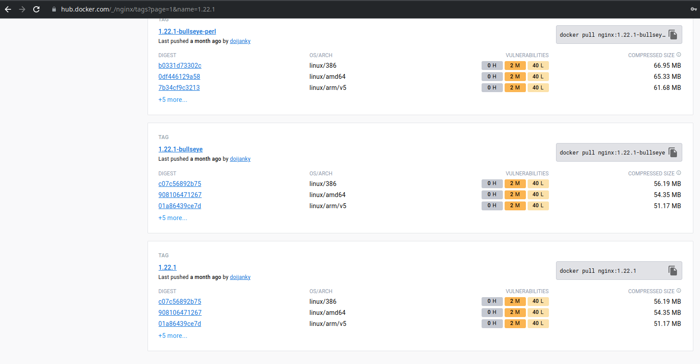

# 01

## Descripción

Mostar los pasos de como se realizo el challenge

## Pasos

### Parte 1

1. Se abrió la pagina de https://hub.docker.com/ y se busco nginx y luego la version 1.22.1

2. Se creo el archivo 1-nginx.sh
3. Se corre el archivo con `sh 1-nginx.sh` y queda constancia que se bajo correctamente.

### Parte 2
1. Iniciar el contenedor con `docker run --name=db -p 3306:3306 -e MYSQL_ROOT_PASSWORD=secret-pw -d mysql:8`

  1. Revisar los logs del contenedor con `docker logs db`
  
  2. Conectar al contenedor con `docker exec -it db bash` y luego conectarte a MySQL por medio del comando `mysql -u root -p`
  
  3. Salir de mysql y del contenedor
  

2. Iniciar el contenedor de PHPMyAdmin: `docker run --name=my-admin -p 82:80 --link db:db -d phpmyadmin`

  1. Comprobando conexión a `localhost:82`
  
  2. Usando las credenciales y accediendo al servicio
  

3. Detener contenedores y borrarlos

