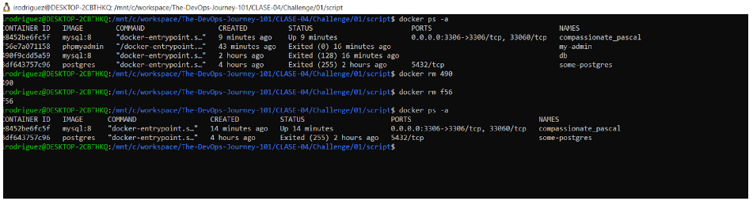

# Documentación challenge 1

A continuación se detallan los pasos seguidos para la resolución del ejercicio
 
## Paso 1

Se creó carpeta con el nombre script en la ruta del repositorio `THE-DEVOPS-JOURNEY-101`. Dentro se creo el archivo 1-nginix.sh.

## Paso 2
Se editó el archivo  `1-nginix.sh` y se agregó cabecera para ejecución `#!/bin/bash`  y el comando para descargar la imagen de la versión `1.22.1` de nginx. Se guardaron los cambios.

## Paso 3

Se ejecutó script con el comando bash `./1-nginix.sh` y se validó que la misma estuviese instalada.

## Paso 4

Se ejecutó comando para iniciar contenedor de mySQL `docker run --name=db -p 3306:3306 -e MYSQL_ROOT_PASSWORD=secret-pw -d mysql:8`.

## Paso 5

Se revisaron los logs del contenedor creado con el comando anterior, ejecutando el comando `docker logs db`.

## Paso 6

Se ejecutó al contenedor de manera interactiva con el comando `docker exec -it db bash` y luego se conectó a MYSQL ejecutando el comando `mysql -u root -p` e ingresando el password definido en el comando usado para crear el contenedor MySQL (secret-pw).

## Paso 7

Se inició el contenedor PHPMyAdmin, ejecutando el comando `docker run --name=my-admin -p 82:80 --link db:db -d phpmyadmin` y se validó que estuviese corriendo en la máquina host.

## Paso 8

Se inició sesión con las credenciales  usuario: `root` y password: `secret-pw`.

## Paso 9

 Se detuvieron los contenedores.

## Paso 10

Se removieron los contenedores usando el shortcut del id  (tres primeros dígitos).

 
