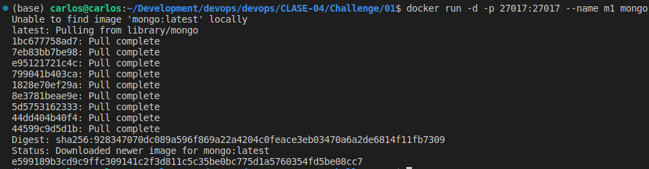
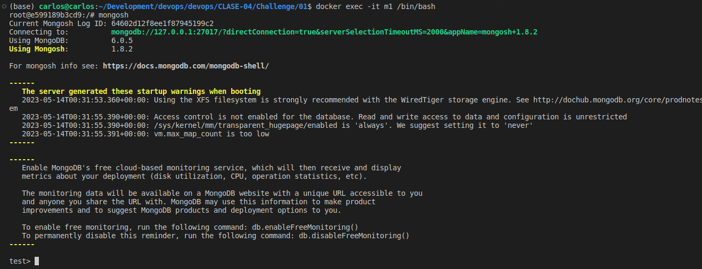
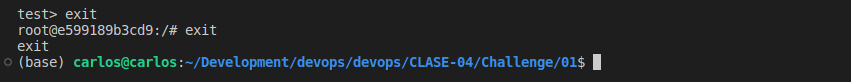
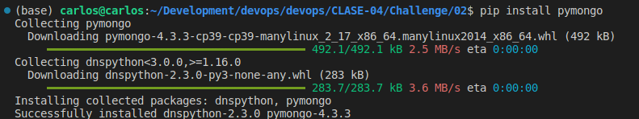
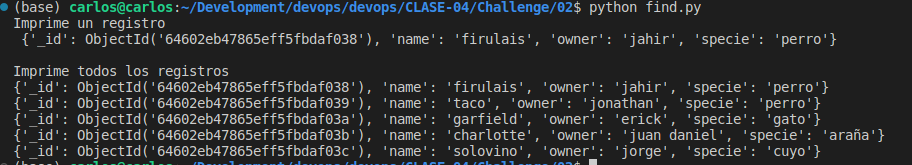
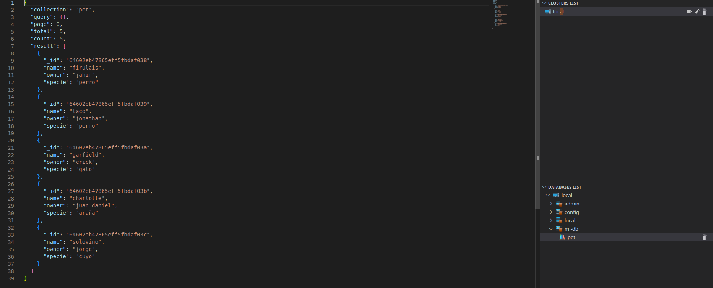
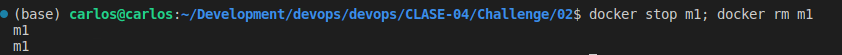

# 02

## Descripción

Mostar los pasos de como se realizo el challenge

## Pasos

### Parte 1

1. Iniciar el contenedor con `docker run -d -p 27017:27017 --name m1 mongo`

  1. Conectar al contenedor con `docker exec -it m1 /bin/bash` y luego conectarte a `MongoDB` por medio del comando `mongosh`
  
  2. Salir de mongodb y del contenedor
  

2. Utilizar los scripts de Python
  1. Instalar la librería de mongo por medio del comando `pip install pymongo`
  
  2. Ejecutar los scripts con `python populate.py` y `python find.py`
  
  3. Revisa los registros con el plugin de vscode mongodb-dly
  

3. Detener contenedores y borrarlos

