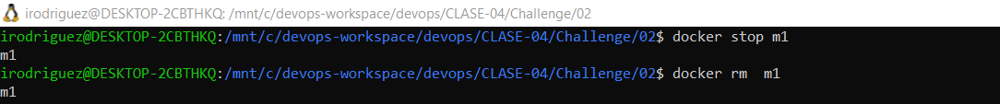

# Documentación challenge 2

A continuación se detallan los pasos seguidos para la resolución del ejercicio.

 

## Paso 1

Se inició el contenedor de `MongoDb` utilizando el comando `docker run -d -p 27017:27017 --name m1 mongo`

## Paso 2
Se conectó al contenedor de Mongo ejecutando el comando `docker exec -it m1 /bin/bash` y posteriormente  `mongosh` para entrar el la shell de `Mongo`.

## Paso 3
Salir de la terminal interactiva ejecutando `exit` seguido de los comandos `Ctrl+P` y `Ctrl+Q`

## Paso 4
Se instaló la libreria `pymongo` usando el comando `pip install pymongo`

## Paso 5

Se ejecutaron los scripts `python populate.py` y `python find.py`.

## Paso 6
Se revisaron los registros agregados a la `Db` creada con los anteriores script usando la shell de Mongo.

## Paso 7
Se detuvo y se removió contenedor de `MongoDb`

