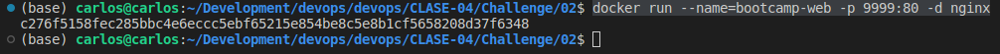
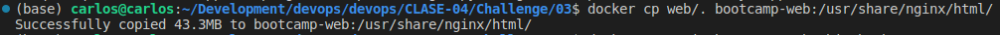
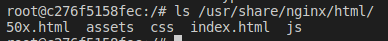
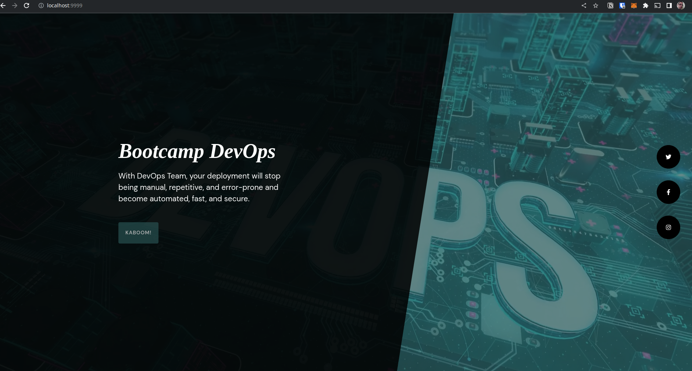
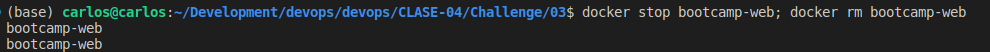

# 03

## Descripción

Mostar los pasos de como se realizo el challenge

## Pasos

1. Iniciar el contenedor con `docker run --name=bootcamp-web -p 9999:80 -d nginx`

2. Copiar archivos

3. Listar los archivos dentro del contenedor

4. Revisar que este disponible el servidor en el puerto 9999

5. Detener contenedores y borrarlos

