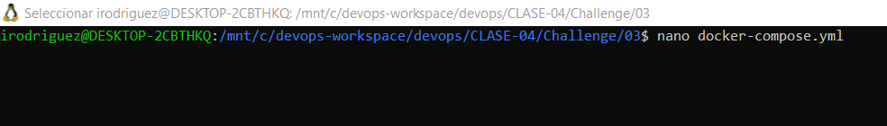
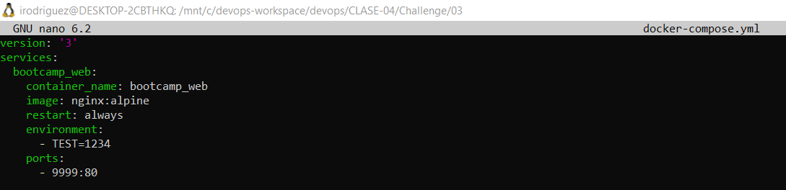
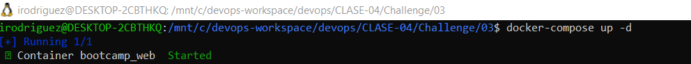
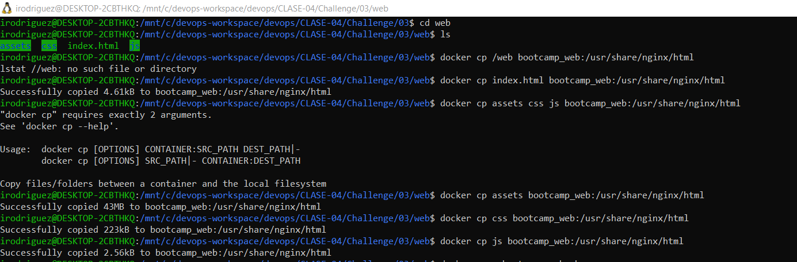
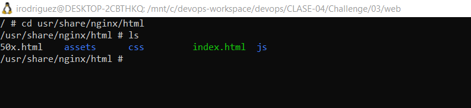
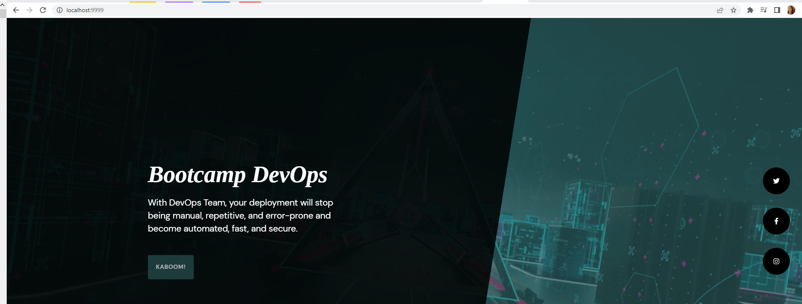

# Documentación challenge 3

A continuación se detallan los pasos seguidos para la resolución del ejercicio.
 

## 1. Crear archivo docker-compose
Se creó en la ruta del challege 03 el archivo `docker-compose.yml`
para crear el cotenedor bootcamp_web con la imagen de `nginx` indicandole como puertos `9999:80`.

## 2. Levantar contenedor
 Se ejecutó `docker-compose up -d`.

## 3. Copiar contenido de la carpeta web 

Desde el directorio `web` se ejecutó comando `docker cp` para ir copiando el contenido de la misma en la ruta del contenedor que sirve la aplicación web.

## 4. Validar que los archivos del directorio web estuviesen en la ruta del cotenedor

Se entró al contenedor con el comando `docker exec -it bootcamp_web sh` y se ejecutó `ls` para validar que los archivos copiados efectivamente estuviesen en el contenedor.

## 5. Validar que se estuviese presetando el contenido de web

En el navegador se constató que la información presentada en `localhost:9999` fuese la correspondiente a la copiada previamente.

