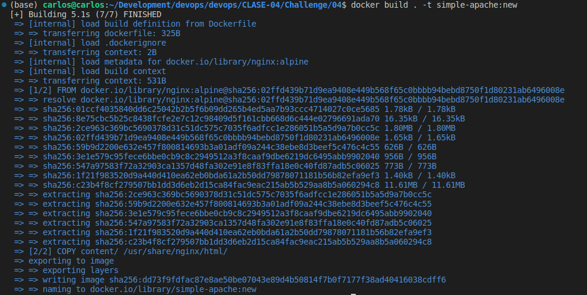
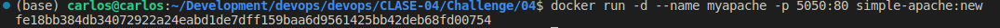
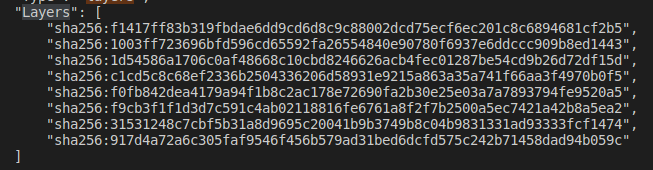
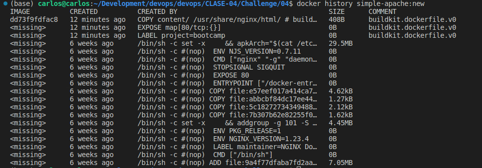
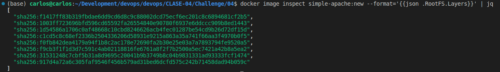
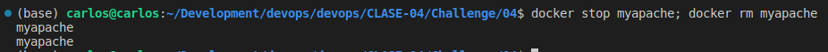

# 02

## Descripción

Mostrar los pasos de como se realizo el challenge

## Pasos

1. Crear archivo Dockerfile y correr el build con `docker build . -t simple-apache:new`

2. Ejecutar un contenedor con mi nueva imagen `docker run -d --name myapache -p 5050:80 simple-apache:new`

3. Averiguar cuántas capas tiene mi nueva imagen
  1. Con el comando `docker inspect simple-apache:new`
  
  2. Con el comando `docker history simple-apache:new`
  
  3. Con el comando `docker image inspect simple-apache:new --format='{{json .RootFS.Layers}}' | jq`
  

5. Detener contenedores y borrarlos

