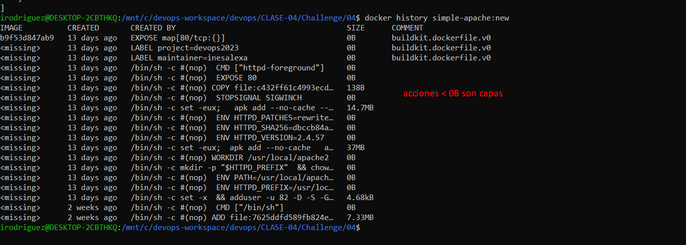

# Documentación challenge 4

A continuación se detallan los pasos seguidos para la resolución del ejercicio.

## 1 Crear archivo Dockerfile

Se creó archivo Dockerfile indicando la imagen a usar de base.

## 2 Ejecutar comando para crear imagen

Se ejecutó comando `docker build . -t simple-apache:new`

## Ejecutar comando con imagen creada

## 3 Averiguar cuantas capas tiene mi nueva imagen

`docker inspect simple-apache:new`  (apartado layer)

`docker history simple-apache:new` (Todas las acciones que son < 0B son capas)

