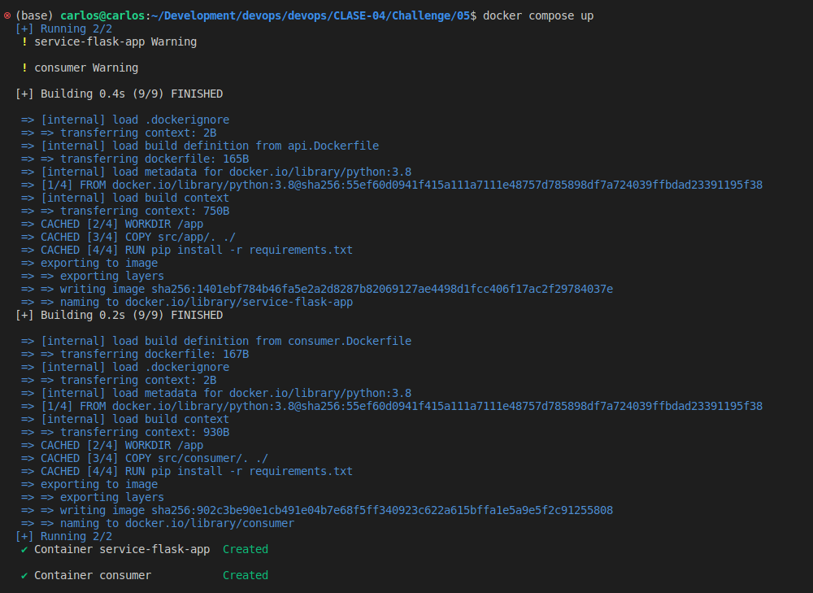
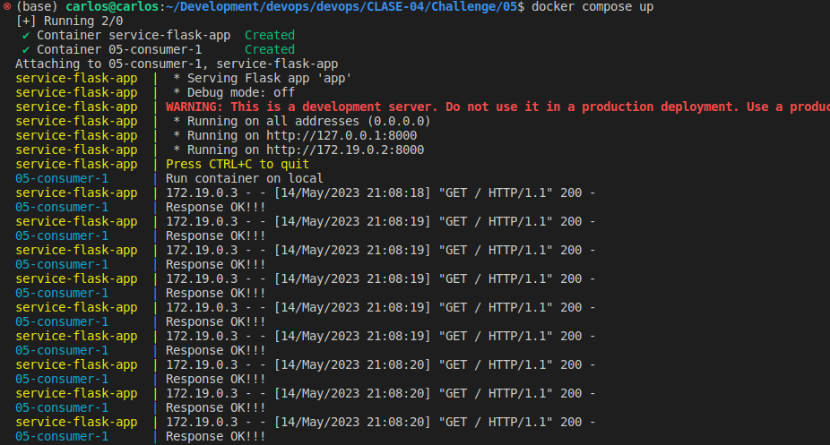
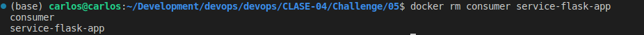

# 05

## Descripción

Mostrar los pasos de como se realizo el challenge

## Pasos

1. Crear archivo Dockerfile para el flask con el nombre `api.Dockerfile`
2. Crear archivo requirements.txt dentro de la ruta del flask
3. Crear archivo Dockerfile para el consumer con el nombre `consumer.Dockerfiler`
4. Crear archivo requirements.txt dentro de la ruta del consumer
5. Crear archivo `docker-compose.yml`
6. Correrlo con el comando `docker compose up`

7. Borrar contenedores

