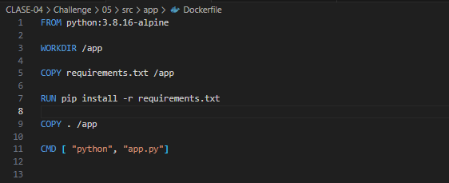
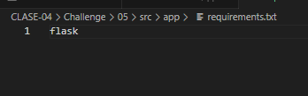
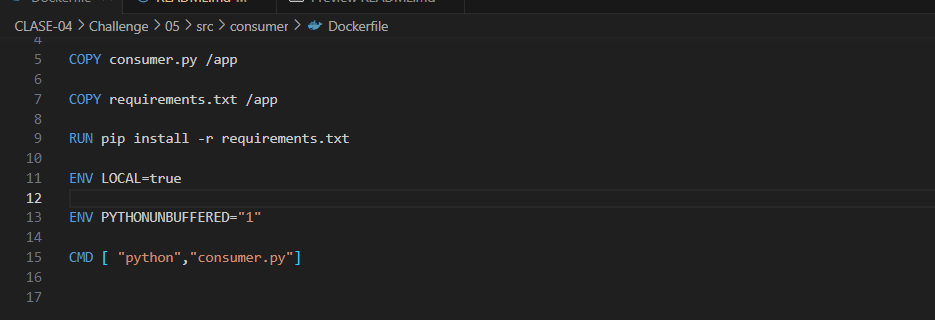
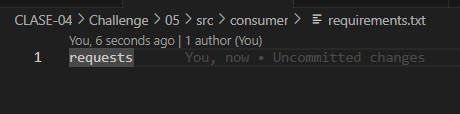
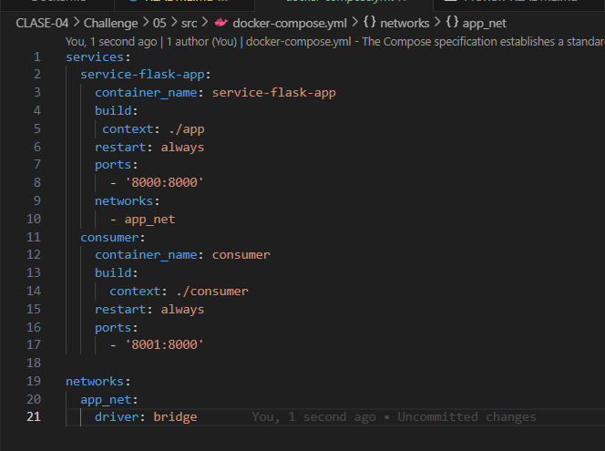
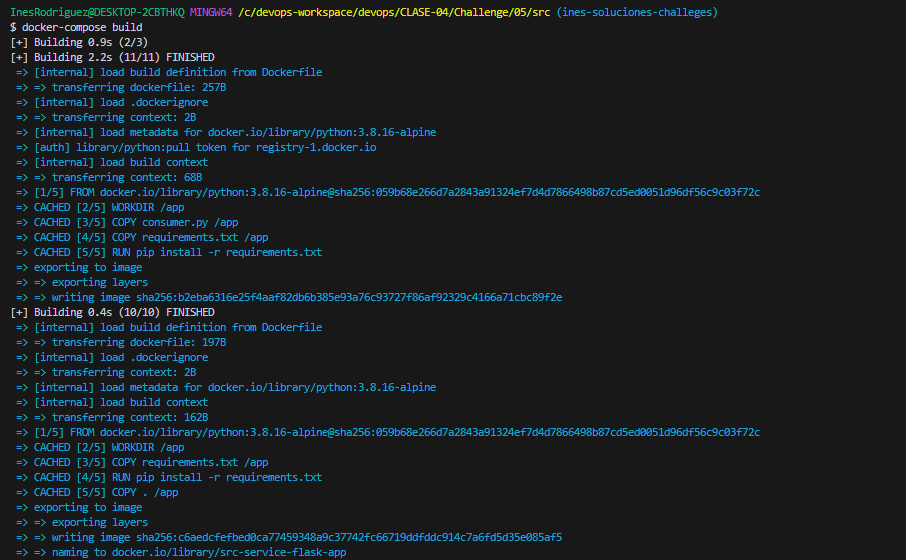
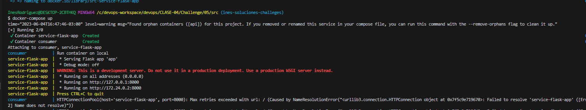
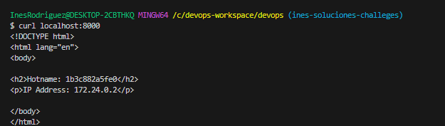
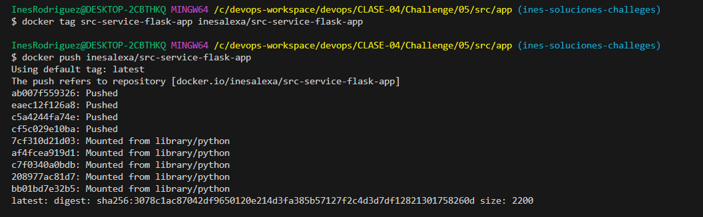
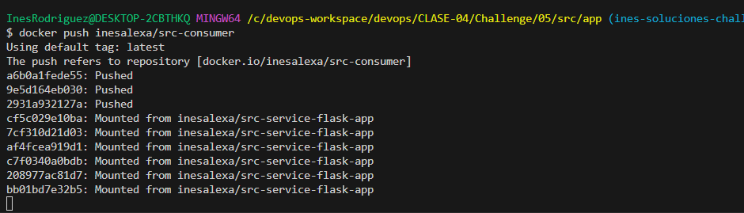

# Documentación challenge 5

A continuación se detallan los pasos seguidos para la resolución del ejercicio.

## 1 Crear archivo Dockerfile Api

Se creó en la ruta `src/app` el archivo Dockerfile para la api y adicionalmente se creó un archivo `requirements.txt` para agregar la dependencia de flask.

## 2 Crear archivo Dockerfile para consumer

Se creó en la ruta `src/consumer` el archivo Dockerfile y el archivo `requiremets.txt`  y se agrego la dependencia de la libreria requests.

## 3 Crear archivo docker-compose.yml

Se creó el archivo `docker-compose.yml` para crear los contenedores a partir de las imagenes de la api y del consumer. En el mismo se definió la network a la que pertenecerian.

## 4 Ejecutar comando docker-compose build

## 5 Ejecutar comando docker-compose up
Para levantar los contenedores.

## Se realizó comprobación mediante curl en localhost:8000

## 6 Crear tag de las imagenes del consumer y api
Una vez creado los tags de las imagenes, se subieron las mismas a dockerhub.

