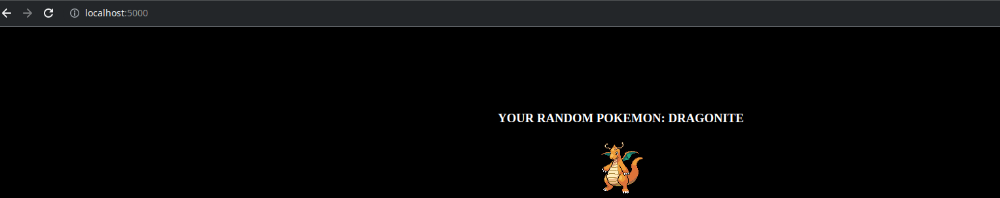

# 06

## Descripción

Mostrar los pasos de como se realizo el challenge

## Pasos

1. Crear archivo Dockerfile para el flask con el nombre `Dockerfile`
2. Construir imagen con el comando `docker build -t carlosrivas2021/pokepy-ejemplo:1.0 .`

3. Listar imagenes con `docker images`

4. Levantar la imagen con el comando `docker run --name pokeapi -d -p 5000:5000 carlosrivas2021/pokepy-ejemplo:1.0`

5. Verificar el funcionamiento en local `localhost:5000`

6. Subirla a docker hub con el comando `docker push carlosrivas2021/pokepy-ejemplo:1.0`

7. Se puede validar en esta url `https://hub.docker.com/r/carlosrivas2021/pokepy-ejemplo`

