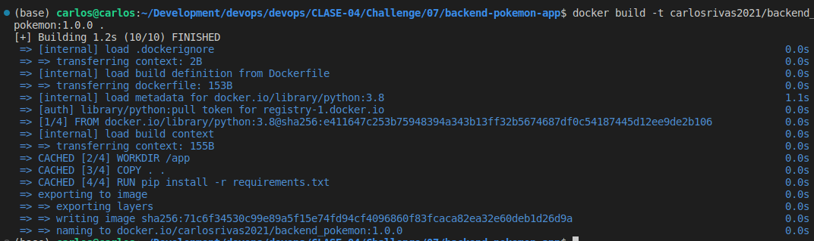
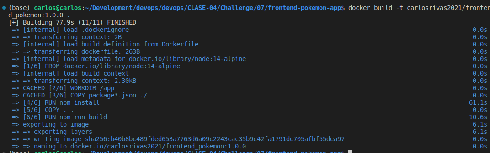
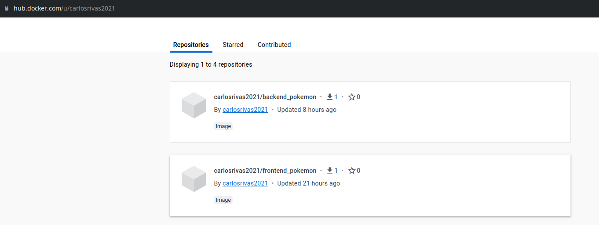
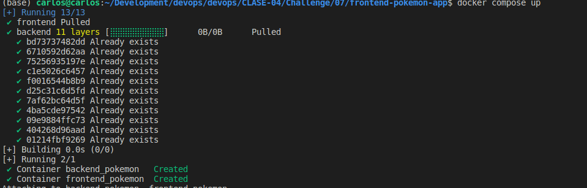
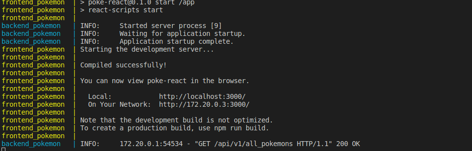

# 07

## Descripción

Mostrar los pasos de como se realizo el challenge

## Pasos

1. Crear archivo Dockerfile para el backend con el nombre `Dockerfile`
2. Construir imagen con el comando `docker build -t carlosrivas2021/backend_pokemon:1.0.0 .`

3. Subirla a docker hub con el comando `docker push carlosrivas2021/backend_pokemon:1.0.0`
4. Crear archivo Dockerfile para el frontend con el nombre `Dockerfile`
5. Construir imagen con el comando `docker build -t carlosrivas2021/frontend_pokemon:1.0.0 .`

6. Subirla a docker hub con el comando `docker push carlosrivas2021/frontend_pokemon:1.0.0`
7. Se puede validar en esta url `https://hub.docker.com/r/carlosrivas2021`

8. Crear archivo `docker-compose.yml`
9. Correrlo con el comando `docker compose up`

