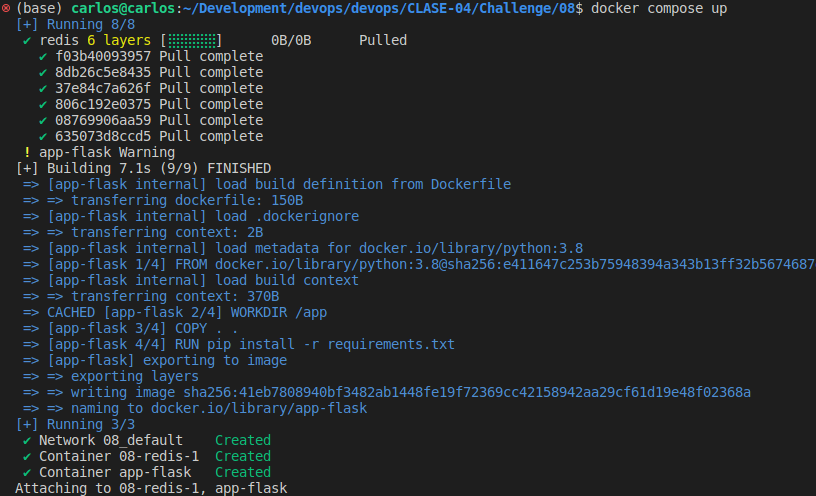
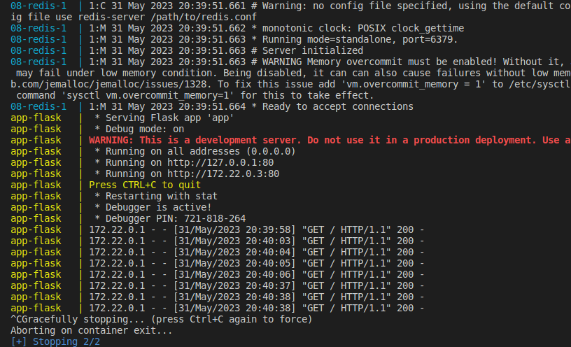

# 08

## Descripción

Mostrar los pasos de como se realizo el challenge

## Pasos

1. Crear archivo Dockerfile para la app `Dockerfile`
2. Crear archivo `docker-compose.yml`
3. Correrlo con el comando `docker compose up`

