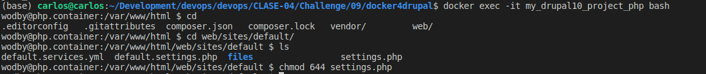

# 09

## Descripción

Mostrar los pasos de como se realizo el challenge

## Pasos

1. Clonar e ir a la ruta clonada cd docker4drupal
2. Correr el comando `docker-compose up -d`

3. Correr el comando `docker ps`

4. Instalar drupal, ir a la url http://drupal.docker.localhost:8000/

5. Instalar drupal, ir a la url http://drupal.docker.localhost:8000/ y seguir los pasos

6. Puede dar error de permisos editando el archivo settings.php
7. Ir al contenedor de drupal php con el siguiente comando `docker exec -it my_drupal10_project_php bash` y darle permisos

8. Continua la instalación

