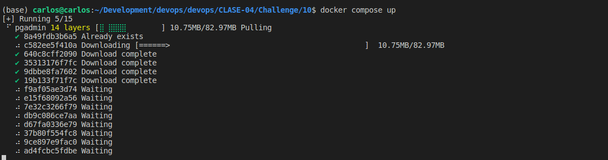
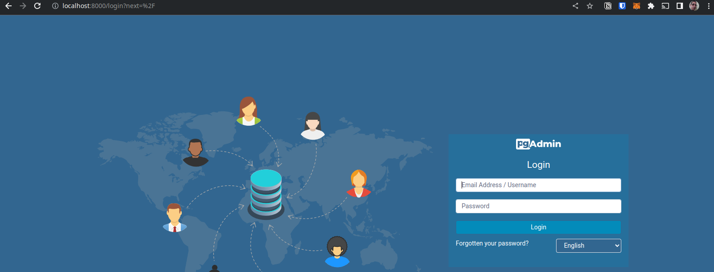
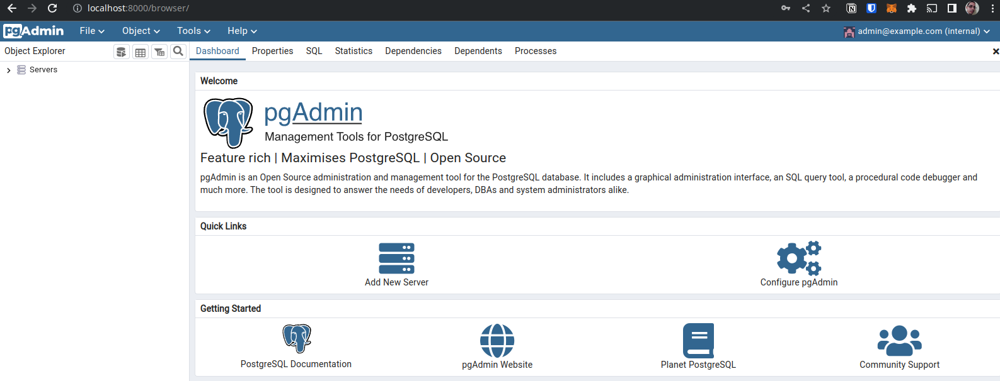
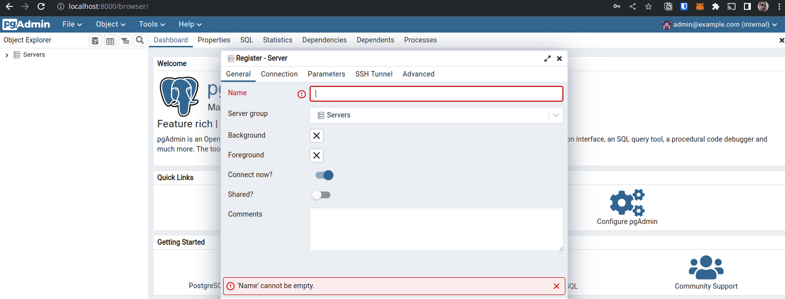
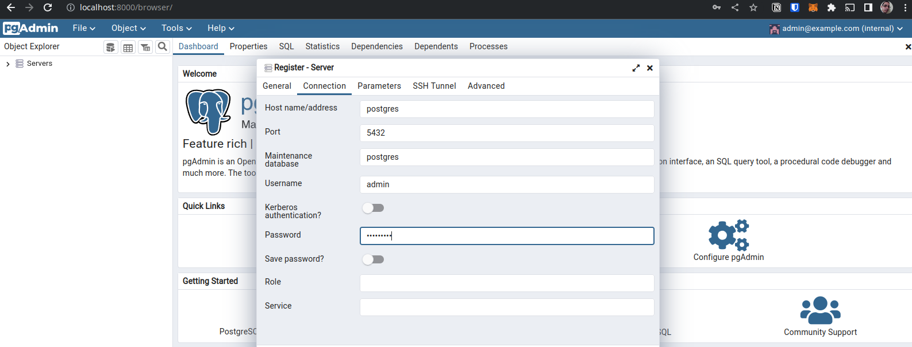
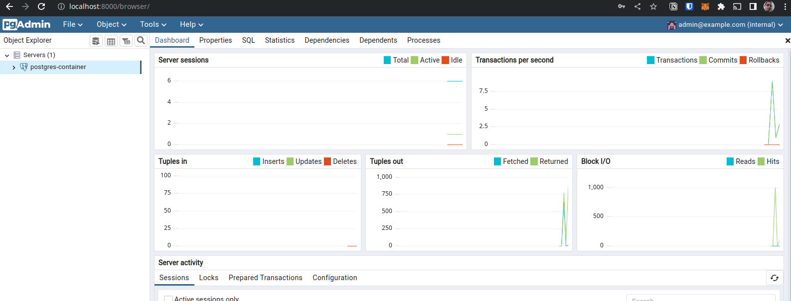
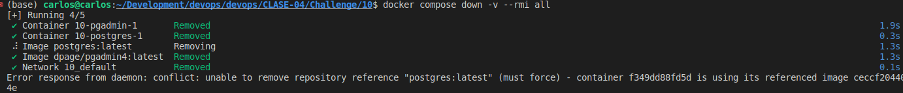

# 10

## Descripción

Mostrar los pasos de como se realizo el challenge

## Pasos

1. Crear archivo `docker-compose.yml` con el postgres y el pgadmin
2. Correr el comando `docker-compose up -d`

3. Entrar al pgadmin en el puerto configurado en el yml y logearse con las variables configuradas

4. Agregar la conexion al servidor postgresql

5. Bajar los contenedores con el comando `docker compose down -v --rmi all`

6. Se puede observar en la imagen anterior que no removió la imagen de postgres porque la he usado para otros contenedores.
