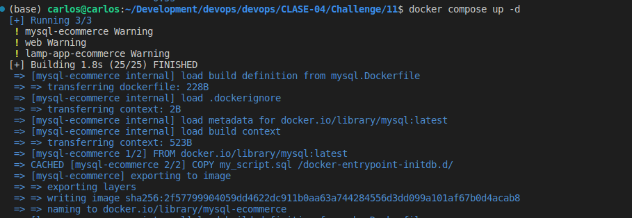
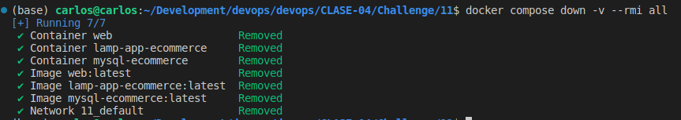

# 11

## Descripción

Mostrar los pasos de como se realizo el challenge

## Pasos

1. Crear archivo `docker-compose.yml` con el mysql, nginx y php
2. Correr el comando `docker-compose up -d`

3. En este caso al usar nginx y php se recomienda según esto https://marc.it/dockerize-application-with-nginx-and-php8/
4. Se usa depends_on en el docker-compose pero recordar que eso espera que el docker inicie no que el servicio este arriba.

5. Bajar los contenedores con el comando `docker compose down -v --rmi all`

